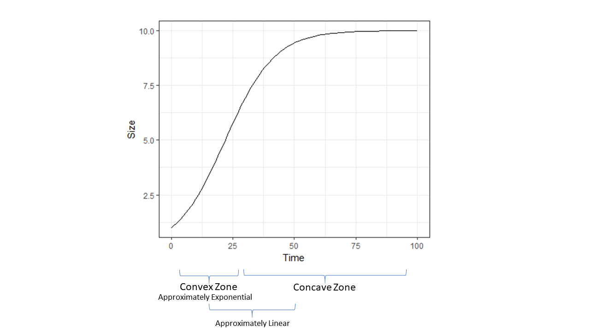

```{r setup, include=FALSE}
knitr::opts_chunk$set(echo = TRUE)
library(ggplot2)


```
### Key Points 
1) Terminology: "linear difference" -> "linear growth"; "log measure" -> "log RGR"; "linear RGR != linear growth"

2) Be clear about the dimensional comparisons. The RGR measures are not dimensionally the same as linear growth (AGR).  

3) RGR measures and all comparisons really, sensitive to the delta (elapsed time between measurements). Linear RGR > log RGR for much of the curve.  

4) Linear growth (AGR) is just as good as log RGR or better for much of the curve in terms of dynamics/prediction. 

5) If the goal is to estimate a treatment effect, linear growth at least is more interpretable, and subject to less statistical estimation variability.  

6) Ulimately, things are inherently complicated in this data limited setting. The problem is when we do NOT know WHERE on the growth curve our observations are coming from. None of the measures discussed here get around this unavoidable fact. 

7) No reason to insist on log RGR in this setting; in fact, several reasons to NOT use it. 

### Background and Rationale 

Analyzing growth of individuals is fundamental in many areas of ecology and biology. A common situation is the need to compare multiple individuals across genotypes or species in experimental or observational settings where variations in initial sizes and environmental factors both contribute to observed variations in growth. In this setting, a common default practice is to re-express growth as a relative measure, dividing the growth increment by the initial size. In the limit as the time period goes to zero, this can be represented as $$\frac{dS}{dt}\frac{1}{S}$$ 

Without explicit specification of a time-varying dynamic, e.g. some kind of non-linear growth function, this representation corresponds to exponential growth. That is, the quantity obtained by integration of $$\frac{dS}{dt}\frac{1}{S} = k$$ over some time period, and given some initial size $S_0$

is simply the familiar exponential equation $$S_t = S_0e^{kt}$$


The quantity in equation 1 is often referred to as relative growth rate (RGR), and the usual method of quantification, hereafter the "log RGR" corresponds to the solution in 2, as is readily checked. The log RGR is, simply $\frac{log(S_2) - log(S_1)}{t}$ The log RGR is very frequently utilized as a default in place of taking the difference $\frac{S_2 - S_1}{t}$, hereafter "linear growth rate", since it is seen as more effectively accounting for variations in initial size, given the understanding that size itself is a fundamental driver of subsequent growth. Note that the linear growth rate could also be divided by $S_1$ to return a "linear RGR". 

XXX et al. (2012) summarized several flaws of the log RGR and recommended instead to fit non-linear growth functions. The non-linear growth functions can then be differentiated with respect to size $S$ in order to obtain a superior RGR measure. I wholeheartedly concur with this advice. However, ecologists are often confronted with datasets where only 2 or 3 time periods are available, thus precluding effective fitting of non-linear functions. In this context, the log RGR is widely recommended.  

In this note, I demonstrate that the linear measures (linear growth rate, and linear RGR) are in many cases superior to the log RGR. To be sure, these quantities should be seen as answers to subtley different questions. My intent is to highlight the underlying assumptions, and challenge the status of log RGR as a default in the data limited setting. 


### Conceptual Overview

First, we assume a basic theoretical framework for growth: the sigmoidal curve. Nearly every biologically motivated growth model follows sigmoidal behavior. For instance, West et al. (2001) famously derived a sigmoidal equation for growth from metabolic scaling theory. Mechanistic models of photosynthesis and leaf area also result in sigmoidal growth (CITE). Although particular sigmoidal models can be challenged, the qualitative pattern is universal. Therefore, we will compare log RGR and linear growth rate to a sigmoidal curve, which is itself presumed to better approximate underlying biological/ecological reality. The conceptual basis of my analysis is encapsulated in the following figure:   

```{r, echo = FALSE, include = FALSE}
sigmoid2 <- function(t,Po=Po,K=K,r=r){
  sig_val <- (K*Po*exp(r*t))/(K+Po*(exp(r*t)-1));
  return(sig_val);
}

Po <- 1;
K <- 10;
r <- 0.1;

ggplot(data = data.frame(t=c(0,100)),aes(x=t)) + stat_function(fun = sigmoid2, args = list(Po,K,r)) + ylab("Size") + xlab("Time") + theme_bw()

# Provide edits in PDF 


```

```{r, echo = FALSE, fig.cap = "Conceptual Argument", out.width = '100%'}


```

The first portion of the sigmoidal curve is convex. In this zone, log RGR is a decent approximation to underyling growth. However, there is an adjcent, larger zone of approximate linearity, where the linear growth rate describes biological reality more closely. Finally, neither approximation is great in the upper portion of the curve, well into its concave portion, although the linear approximation is uniformly superior throughout the concave zone. 

### Mathematical Analysis of Log RGR    

## General Taylor Series Approximation 

Mathematically, the argument can be boiled down for any generic equation for growth over time: $S_t = f(S,t)$. Using Taylor Series, we can approximate around some value $a$ to second order with a generic function $g(S,t)$ as: $$f(S,t) \approx g(S=a,t) + g'(S=a,t) \times (S-a) + \frac{1}{2}g''(S=a,t)\times(S-a)^2$$  

As noted above, the canonical log RGR corresponds to exponential dynamics $S_t = S_0e^{kt}$. Use of exponential dynamics to approximate $S_t = f(S,t)$ obviously only works well where both the first and second derivative of $f(S,t)$ are positive (i.e. where function is convex). Given that the second derivative of any sigmoidal curve flips from positive to negative, this approximation error grows rapidly outside of a narrow zone. 

## Analysis 
We take the familiar logistic equation as a reasonable representaton for sigmoidal growth, while noting that many options are available: 

$$S_t = \frac{KS_0e^{rt}}{K+S_0(e^{rt}-1)}$$

Given this representation of underlying growth, the first question is: what does the canonical log measure $\frac{log(S_2) - log(S_1)}{t}$ correspond to? In other words, we want to ask what happens given exact measurements of $S_2$ and $S_1$, given that they are sampled from above equation. For $log(S_t)$ We have: 

$$\log(S_t) = log(K) + log(S_0) + rt - log(K + S_0(e^{rt}-1))$$

If we have size observations $S_1$ and $S_2$ from two times, $t_1$ and $t_2$,the difference between them is: 

$$\log(S_2) - log(S_1) = r(t_2 - t_1) + log(\frac{K + S_0(e^{rt_1}-1)}{K + S_0(e^{rt_2}-1)})$$

For any given interval $t_2~t_1$:  
$$\frac{log(S_t) - log(S_0)}{t_2 - t_1} = r + \frac{1}{t_2-t_1}log(\frac{K + S_0(e^{rt_1}-1)}{K + S_0(e^{rt_2}-1)})$$
One flaw of log RGR (as pointed out previously by XXXX) is that RGR is really time-varying, but in effect treated as though time constant (by necessity given the limitation of data). If we want to investigate how this quantity varies with sampling of arbitrary timepoints $t_2$ and $t_1$ along the sigmoidal curve, we re-express $t_2=t_1+\Delta$ and let $t_1=t$
$$\frac{log(S_{t+\Delta}) - log(S_t)}{\Delta} = r + \frac{1}{\Delta}log(\frac{K + S_0(e^{rt}-1)}{K + S_0(e^{r({t+\Delta})}-1)})$$

### Log RGR versus Linear RGR 

Graphically, the comparison with the observed growth increments is: 
```{r, echo = FALSE}
log_sigmoid <- function(t,delta=delta,Po=Po,K=K,r=r){
  log_val <- r + (1/delta)*log((K+Po*(exp(r*t)-1))/(K+Po*(exp(r*(t+delta))-1)));
  return(log_val);
}

sigmoid <- function(t,delta,Po=Po,K=K,r=r){
  sig_val <- (1/delta)*(((K*Po*exp(r*(t+delta)))/(K+Po*(exp(r*(t+delta))-1))) - ((K*Po*exp(r*t))/(K+Po*(exp(r*t)-1))));
  return(sig_val);
}

#log(9) - log(7)

Po <- 1;
K <- 10;
r <- 0.1;
delta <- 5 

#log_sigmoid_error(50,Po,K,r,delta)

ggplot(data = data.frame(t=c(0,100)),aes(x=t)) + stat_function(fun = log_sigmoid, args = list(delta,Po,K,r), color = "red") + stat_function(fun = sigmoid, args = list(delta,Po,K,r)) + ylab("Measure") + xlab("Time") + ggtitle("Log RGR (red) versus Growth Increments (black)") + theme_bw()

```

Although striking, this comparison is misleading since the quantites differ in dimesion. The log measure is really a **rate** with dimensions of $\frac{1}{time}$, and I should note that the usual re-expression as $g~g^-1~time^-1$ is unhelpful at best. In order to make a dimensionally valid comparison, the linear measure must be divided by the initial mass. Here is the result of doing so: 

```{r, echo = FALSE}

RGR_log <- function(t,delta=delta,Po=Po,K=K,r=r){
  log_val <- r + (1/delta)*log((K+Po*(exp(r*t)-1))/(K+Po*(exp(r*(t+delta))-1)));
  return(log_val);
}

RGR_sigmoid <- function(t,Po=Po,K=K,r=r){
  RGR <- (r*exp(-r*t)*(K-Po))/(Po + exp(-r*t)*(K-Po))
  return(RGR); 
}

RGR_lin <- function(t,delta=delta,Po=Po,K=K,r=r){
  line_slope <- (((K*Po*exp(r*(t+delta)))/(K+Po*(exp(r*(t+delta)))-1)) - ((K*Po*exp(r*t))/(K+Po*(exp(r*t)-1))))/(delta);
  #line_function <- (K*Po*exp(r*t1))/(K+Po*(exp(r*t1)-1)) + 
  #line_slope*(t-t1);
  return(line_slope/((K*Po*exp(r*t))/(K+Po*(exp(r*t)-1))));
}

#log(9) - log(7)

Po <- 1;
K <- 10;
r <- 0.1;
delta <- 20

#log_sigmoid_error(50,Po,K,r,delta)

ggplot(data = data.frame(t=c(0,100)),aes(x=t)) + stat_function(fun = RGR_log, args = list(delta,Po,K,r), color = "red") + stat_function(fun = RGR_lin, args = list(delta,Po,K,r), color = "blue") +
  stat_function(fun = RGR_sigmoid, args = list(Po,K,r)) + ylab("RGR (compared)") + xlab("Time") + theme_bw() + ggtitle("True RGR versus log RGR (red) and linear RGR (blue)")

```

As expected, the log RGR outperforms the linear RGR in matching the real (time varying) RGR early in the convex portion of the curve, then gets outperfomed by the linear RGR thereafter. Both become pretty bad in the concave portion of the curve. 

The question is, given a set of data with one or two observation periods, what quantity should be analyzed? The log RGR, the linear growth rate, or perhaps the linear RGR? First, as noted above, these quantities are answers to different questions at some level. The RGR measures differ in dimension from the linear growth rate measure. They answer the question: how much new growth occurs as a function of size? The linear growth rate extrapolates growth independent of size. Despite the conceptual defects of the latter,  
**the only reason to prefer the former is the idea that, in the long run, it will better predict growth dynamics.** 

We have already rejected the idea that, in the data limited setting considered here, we are getting an accurate understanding of time-varying growth. In order to game this out, we need to look at implied dynamics. 

<!-- 
If we simplify, and set $t_1=0$, thus $S_1 = S_0$, re-expressing $t_2=t$, we have: 
$$\frac{log(S_t) - log(S_0)}{t} = r + \frac{1}{t}log(\frac{K}{K + P_0(e^{rt}-1)})$$

Thus, if we theoretically make error-free observations over time of a plant, or any other organism for that matter, following sigmoidal growth function above, and re-express our growth increment as the log of the size at time $t$ minus log of initial size, our observations will follow equation X above. Graphically, this curve:

```{r sigmoid log-sigmoid comparison, echo = FALSE, include = FALSE}
log_sigmoid <- function(t,Po=Po,K=K,r=r){
  log_val <- r + (1/t)*log(K/(K+Po*(exp(r*t)-1)));
  return(log_val);
}


sigmoid <- function(t,Po=Po,K=K,r=r){
  sig_val <- ((K*Po*exp(r*t))/(K+Po*(exp(r*t)-1)) - Po)/t;
  return(sig_val);
}

Po <- 1;
K <- 10;
r <- 0.1;
#log_sigmoid(Po,K,r,t=1)

ggplot(data = data.frame(t=c(0,100)),aes(x=t)) + stat_function(fun = log_sigmoid, args = list(Po,K,r)) + theme_bw()

```


Thus, a good deal of the potential for detecting **growth** is washed out of the measure, particularly of course where the sigmoidal curve flips from convex to concave. This is not theoretically surprising, and, as noted above, we concur with the general recommendation to always fit a more suitable non-linear growth model where a time series of data ${S}^N_{i=1}$ is available. 

From a theoretical point of view, in fact, it makes just as much sense to exponentiate the observed size values $S_2$ and $S_1$, $e^{S_2} - e^{S_1}$. On the face of it, this seems absurd. Certainly, unlike the log measure, this does not correspond to any kind of potential growth dynamic. But the effect here is to linearize the concave portion of the sigmoidal curve, exactly analogous to linearizing the convex portion of the curve with the log measure.   

The practical point here is that use of the log-transformed measure should *not* be routine in analyses of ecological growth data, outside of the context where exponential growth actually makes sense *a priori*. 
-->

### Comparing log RGR and linear growth in terms of dynamics  

Use of the linear growth rate $\frac{S_2 - S_1}{t}$ corresponds to assumption of a static linear growth rate dynamic, just as use of $\frac{log(S_2) - log(S_1)}{t}$ corresponds to assuming a static exponential growth rate dynamic. In the latter case, the log RGR has the nice property of representing an ergodic observable (sensu Peters and Gell-man 2016), but is only truly valid assuming exponential growth. While widely (and rightly) dismissed as unrealistic, the linear growth rate $\frac{S_2 - S_1}{t}$ may in fact be a generally superior measure for ecological analysis where no time series of size/biomass data is available.  

The comparison made here is the goodness of fit implied by replacing the sigmoidal $S_t$ with either a linear approximation or an exponential approximation, given sampling of size from two pairs of time points: 1) from the early ("exponential") portion of sigmoid curve, and 2) from the middle ("linear") portion of sigmoidal curve, and 3) from the saturating part of curve. 

1) $t_2 = 14$ and $t_1=2$:

```{r, echo = FALSE, message = FALSE}
t2 <- 14
t1 <- 2

sigmoid2 <- function(t,Po=Po,K=K,r=r){
  sig_val <- (K*Po*exp(r*t))/(K+Po*(exp(r*t)-1));
  return(sig_val);
}

sigmoid_lin_approx <- function(t,t1,t2,Po=Po,K=K,r=r){
  line_slope <- ((K*Po*exp(r*t2))/(K+Po*(exp(r*t2)-1)) - (K*Po*exp(r*t1))/(K+Po*(exp(r*t1)-1)))/(t2-t1);
  line_function <- (K*Po*exp(r*t1))/(K+Po*(exp(r*t1)-1)) + 
  line_slope*(t-t1);
  return(line_function);
}

sigmoid_exp_approx <- function(t,t1,t2,Po=Po,K=K,r=r){
  r_est <- (log(((K*Po*exp(r*t2))/(K+Po*(exp(r*t2)-1)))) - log((K*Po*exp(r*t1))/(K+Po*(exp(r*t1)-1))))/(t2-t1);
  exp_function <- ((K*Po*exp(r*t1))/(K+Po*(exp(r*t1)-1)))*exp(r_est*(t-t1));
  return(exp_function);
}


ggplot(data = data.frame(t=c(0,50)),aes(x=t)) + stat_function(fun = sigmoid2, args = list(Po,K,r)) + stat_function(fun = sigmoid_exp_approx, args = list(t1,t2,Po,K,r), color = "red") +
  stat_function(fun = sigmoid_lin_approx, args = list(t1,t2,Po,K,r),color = "green") +
  theme_bw() + scale_y_continuous(limits = c(0,15)) + ggtitle("True growth (black) versus exponential (red) or linear (green) approximations")


```

As expected, the exponential approximation works better with data from the convex portion of growth curve. However, the improvement is marginal in absolute value, and quickly diverges outside of the convex portion (in accord with our intuitive model). 

2) $t_2 = 25$ and $t_1 = 12$:

```{r, echo=FALSE, message = FALSE}


t2 <- 25
t1 <- 12


ggplot(data = data.frame(t=c(0,50)),aes(x=t)) + stat_function(fun = sigmoid2, args = list(Po,K,r)) + stat_function(fun = sigmoid_exp_approx, args = list(t1,t2,Po,K,r), color = "red") +
  stat_function(fun = sigmoid_lin_approx, args = list(t1,t2,Po,K,r),color = "green") +
  theme_bw() + scale_y_continuous(limits = c(0,15)) + ggtitle("True growth (black) versus exponential (red) and linear (green) approximations")


```

As can be seen, the linear model is a better approximation where data are taken from within the center part of the growth cycle. Again, the improvement is marginal, but real. Forecast accuracy is much higher, and backcast accuracy marginally worse. 

3) $t_2=45$ and $t_1=30$ 

```{r, echo = FALSE, message = FALSE}

t2 <- 45
t1 <- 30 


ggplot(data = data.frame(t=c(0,50)),aes(x=t)) + stat_function(fun = sigmoid2, args = list(Po,K,r)) + stat_function(fun = sigmoid_exp_approx, args = list(t1,t2,Po,K,r), color = "red") +
  stat_function(fun = sigmoid_lin_approx, args = list(t1,t2,Po,K,r),color = "green") +
  theme_bw() + scale_y_continuous(limits = c(0,15)) + ggtitle("True growth (black) versus exponential (red) and linear (green) approximations")


```

As expected, in this scenario, the linear approximation is uniformly better and thus always to be preferred.

At this point, we have seen that the linear growth rate has a large range in which it is superior to the log RGR in terms of implied dynamics (ability to forecast real growth), as well as in terms of approximating the "true" instantaneous RGR.  


### Statistical Properties of Log RGR 

We can derive the sampling distribution of the log RGR  $\frac{log(S_2) - log(S_1)}{t}$ based on a Taylor Series' approximation. Specifically, we consider measurements $S_2$ and $S_1$ with normally distributed error, where the variance scales with the mean (a fairly typical property in biological/ecological data). The distribution of $S_2$ - $S_1$ is then simply the difference of two Normals. Next, we approximate the moments of the distribution of $log(S_t)$ as: $$E[log(S_t)] \approx log(\mu_{S_t}) - \frac{\sigma^2}{2*\mu_{S_t}^2}$$. Using the delta method for variance, we have: $$Var[log(S_t)] \approx \frac{\sigma^2}{\mu_{S_t}^2}$$

Given a constant coefficient of variation (reflecting variance scaling with mean on the original scale) $CV_s$ the sampling distribution of $\frac{log(S_2) - log(S_1)}{t}$ (setting $t$ to unit scale), is therefore: $$ N(log(S_2) - log(S_1), \sqrt2CV_s)$$ 

The CV of the log measure is then related to the expectaiton of the Z scores of the new sampling distribution, and is inversely proportional to statistical power: $$CV_l =\frac{\sqrt2}{log(S_2) - log(S_1)}CV_s$$

Thus, where $log(S_2) - log(S_1) > \sqrt2$ over a unit time increment, the log RGR should have greater statistical power, while it loses statistical power as the log RGR declines. This can be reformulated as $S_2=S_1e^{\sqrt2}$, revealing a *scale free* property of statistical analysis of the log RGR. Specifically, wherever the multiplicative growth increase on a unit time scale $<e^{\sqrt2}$, the log RGR has worse statistical properties than the linear growth rate. 

For our previous parameter value simulations above, here is the curve of $CV_l$ with time $t$, expressed in multiples of $CV_s$: 
```{r, echo = FALSE}

master_func <- function(t,delta,Po=Po,K=K,r=r){
  log_mu_val_1 <- log((K*Po*exp(r*(t*delta)))/(K+Po*(exp(r*(t*delta))-1)));
  log_mu_val_2 <- log((K*Po*exp(r*((t*delta)+delta)))/(K+Po*(exp(r*((t*delta)+delta))-1)));
  cv_val_1 <- 0.2
 cv_val_2 <- 0.2
 
mu_log_diff <- (log_mu_val_2 - log_mu_val_1 - (1/sqrt(2))*(cv_val_1)^2 + (1/sqrt(2))*cv_val_2^2)/delta;


var_log_diff <- ((cv_val_1^2) + (cv_val_2^2))/delta^2;

cv_log_diff <- sqrt(var_log_diff)/mu_log_diff; 
return(cv_log_diff/cv_val_1);
}

#master_func2 <- n; 
# log_mu_val_1 <- log((K*Po*exp(r*(t*delta)))/(K+Po*(exp(r*(t*delta))-1)));
#  log_mu_val_2 <- log((K*Po*exp(r*((t*delta)+delta)))/(K+Po*(exp(r*((t*delta)+delta))-1)));
#  cv_val_1 <- 0.2
# cv_val_2 <- 0.2
#mu_1 <- exp(log_mu_val_1); 
#sd_1 <- mu_1*cv_val_1;
#mu_2 <- exp(log_mu_val_2);
#sd_2 <- mu_2*cv_val_2; 


ggplot(data = data.frame(t=c(0,50/delta)),aes(x=t)) + stat_function(fun = master_func, args = list(delta,Po,K,r)) + geom_hline(aes(yintercept = 1),color = "red", linetype = "dashed") + theme_bw() + ylab("Dimensionless CV") + xlab("Dimensionless Time") + ggtitle("Sampling variance of linear growth (red dashed) versus log RGR (black) measures")

```

As can be seen, in this situation, it is always worse! What happens if we accelerate growth rate considerably (10X)

```{r, echo = FALSE}
r2 <- r*10 
K2 <- K*5
delta <- 5

ggplot(data = data.frame(t=c(0,50/delta)),aes(x=t)) + stat_function(fun = master_func, args = list(delta,Po,K=K2,r=r2)) + geom_hline(aes(yintercept = 1),color = "red", linetype = "dashed") + theme_bw() + scale_x_continuous(limits = c(0,2)) + ylab("Dimensionless CV") + xlab("Dimensionless time") + ggtitle("Sampling variance of linear growth (red dashed) versus log RGR (black) measures")


```

Expressed on a dimensionless time scale representing multiples of $\Delta$ we see that there is a small zone of equivalence. But essentially, it is uniformly less powerful. In the end, it is perhaps not too surprising that it is more difficult to estimate an RGR than a GR. Nevertheless, this should give pause to default use of log RGR. 


### Case Study

Maybe not necessary here. Theoretical demonstration feels complete. OTOH, data are what motivate this! 


### Conclusions and Recommendations 

In summary, the chief virtue of the log RGR $\frac{log(S_2) - log(S_1)}{t}$ measure in the data limited setting is that it is best suited to estimate RGR in approximately exponential phases of growth. In a narrow band of the sigmoid curve, it is arguably superior to working with linear growth rate or RGR.  

The much maligned linear growth rate is a superior default on three grounds therefore. First, it represents an intuitive quantity with dimensions of size/length/mass, whereas any RGR has dimensions of $\frac{1}{time}$). Second, interpreted in terms of dynamics, it is *a better approximation* than the exponential dynamics implied by the log RGR in many parts of the growth curve. Third, it has superior statistical properties almost everywhere. 

The widespread use of the log RGR $\frac{log(S_2) - log(S_1)}{t}$ as an *a priori* preferred default for the data-limited situation should be abandoned. Where only two or three time points are available, fitting a linear growth trend is just as good if not better than estimating an exponential growth rate (log RGR). Unfortunately, none of the measures discussed here can overcome a critical problem in this setting: we do NOT know what portion of the sigmoidal growth curve we are sampling from, in many cases. In this context, careful thought and attention is needed in making comparisons among possible measures. 

The ideal scenario is to collect a proper time series (5-7+) and fit a proper growth model. Where data are at all limiting, I recommend careful incorporation of literature values and other external information as priors in a fully Bayesian analysis in order to regularize inferences. 


